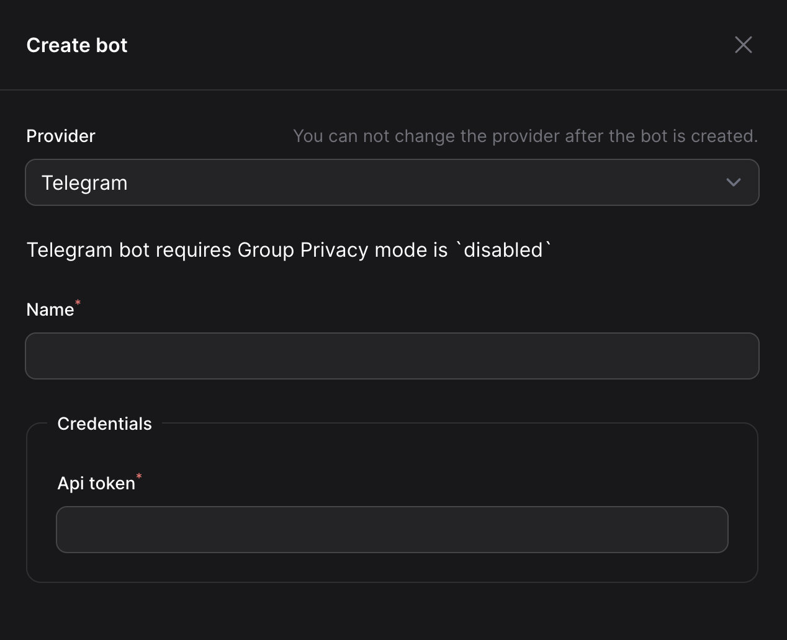

# Create a bot

In Ping2me, we only manage bots which are created by you. Bot mean the bot from your chat app (e.g. Telegram, Discord, Slack, etc.) which will be used to send messages to your channels.

## Create bot on Ping2me

- First of all, you need to select a Provider, which is your chat app (e.g. Telegram, Discord, Slack, etc.)
- Name is just a name of your bot, it can be anything you want
- Credential is the token of your bot. For example, if you want to send messages to a Telegram group, you need to provide the bot token here. Depends on your provider, you may need to provide more information here.

::: info
Don't worry if you don't know create a bot on your chat app, we will guide you through the process.
:::

## Create a Telegram bot