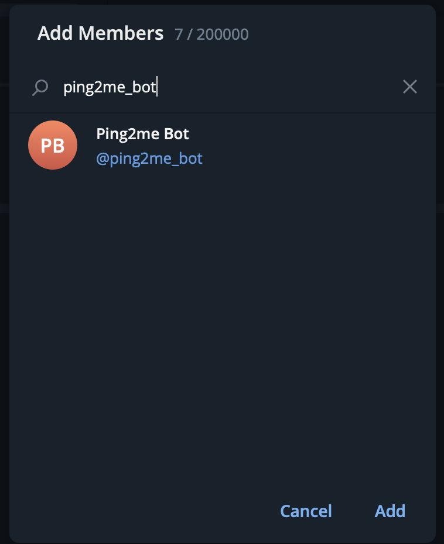
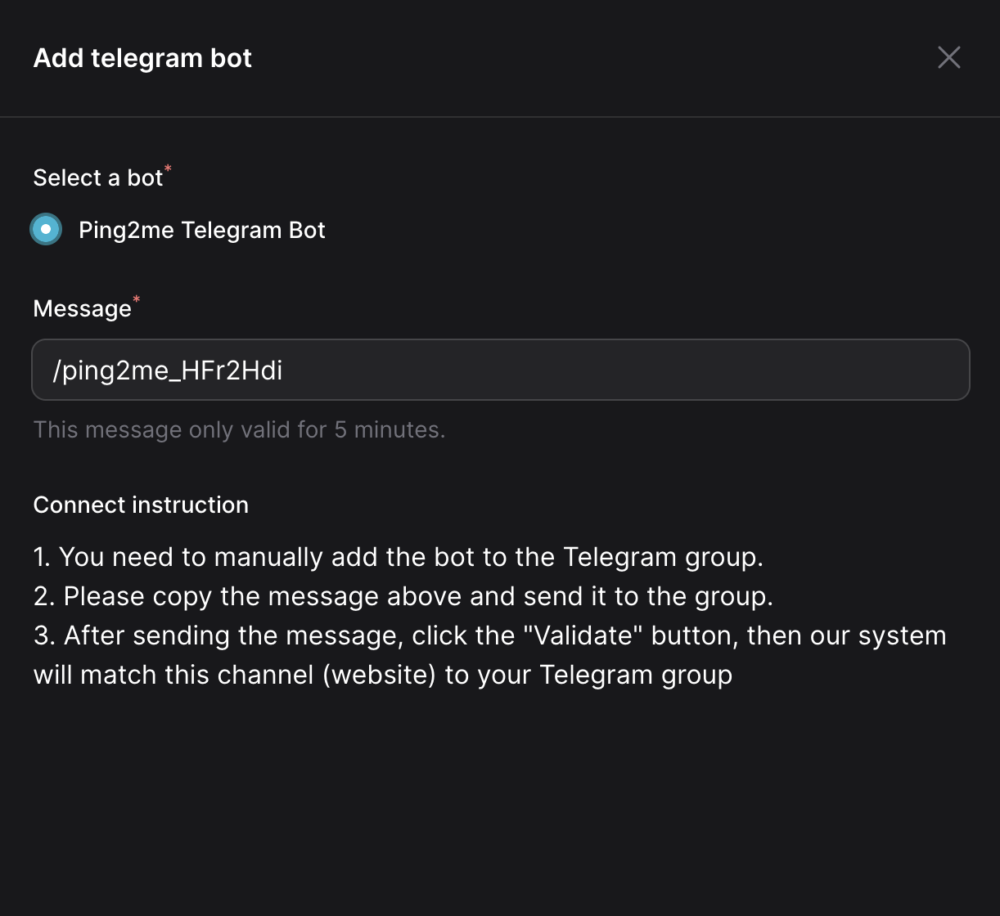
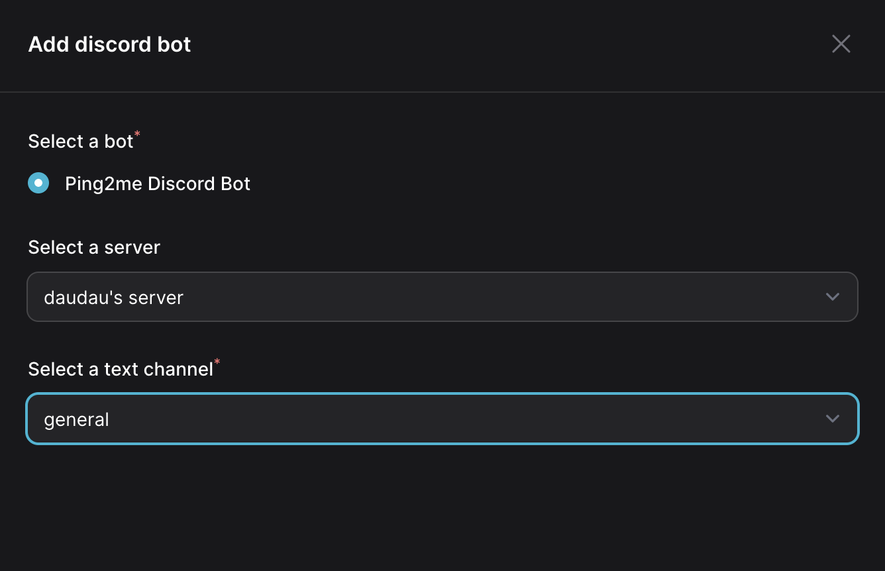
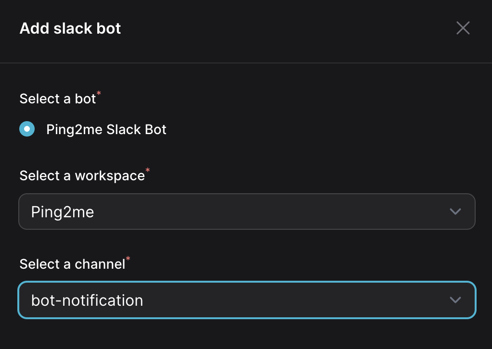

# Add bot to a channel

With the simplicity mindset from the beginning, we make it easy to to connect the bot to a channel by just do some simple steps. First you need to create a bot, then a channel, afterwards you can see `Add bot` button on the channels page.

::: info
There is a little bit limitation here, you can only connect bot and channel with the same provider. For example, you can only connect a Telegram bot to a Telegram channel.
:::

## Add a Telegram bot
Before adding Telegram bot to the channel, you need actually (on Telegram) add bot to your channel (Telegram) first.

Now, back to Ping2me channel list, click `Add Telegram bot` next to the channel you want to add bot to.

Afterward, a connect form displays, you need to select a bot. Then copy the generated message, send it to your channel (Telegram). This help us to verify that you are the owner of the channel and detect the channel id, which is the most boring part of the process.
Finally, click `Validate` button to validate the connection.

## Add a Discord bot
Before adding Discord bot to the channel, you need actually (on Discord) add bot to your Server (Discord) first. You can follow [this guide](https://discordjs.guide/preparations/adding-your-bot-to-servers.html#bot-invite-links){target=_blank} to add bot to your server.

Now, back to Ping2me channel list, click `Add Discord bot` next to the channel you want to add bot to.

Afterward, a connect form displays, you select a Discord bot, then select the server and channel you want to connect to. Finally, click `Validate` button to validate the connection.

## Add a Slack bot
Before adding Slack bot to the channel, you need actually (on Slack) add bot to your workspace (Slack) first. You can follow [this guide](https://slack.com/intl/en-vn/help/articles/115005265703-Create-a-bot-for-your-workspace){target=_blank} to add bot to your workspace.

Now, back to Ping2me channel list, click `Add Slack bot` next to the channel you want to add bot to.

Afterward, a connect form displays, you select a Slack bot, then select the channel you want to connect to. Finally, click `Validate` button to validate the connection.

