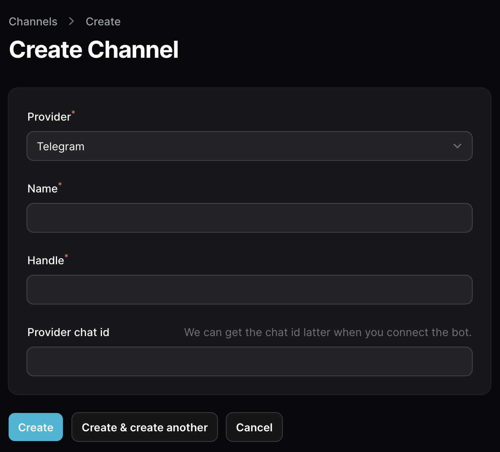

# Create a channel

In Ping2me, Channel is a gateway which used to received messages from external systems, then forward them to coresponding chat app's channel (e.g. Telegram's group, Discords's channel)

## Let create your first channel

::: info
At the moment, we do not support edit channel provider, so please make sure you choose the correct provider when creating a channel.
:::

- First of all, you need to select a Provider, which is your chat app (e.g. Telegram, Discord, Slack, etc.)
- Name is just a name of your channel, it can be anything you want
- Handle is a unique identifier of your channel, it will be used to generate a webhook url, so you can use it to send messages to your channel. By default, handle will be generated from your channel name, but you can change it to anything you want.
- Provider chat id is the id of your channel in your chat app. For example, if you want to send messages to a Telegram group, you need to provide the group id here. If you want to send messages to a Discord channel, you need to provide the channel id here. But don't worry, we will handle this boring step for you, so just leave it blank for now.

