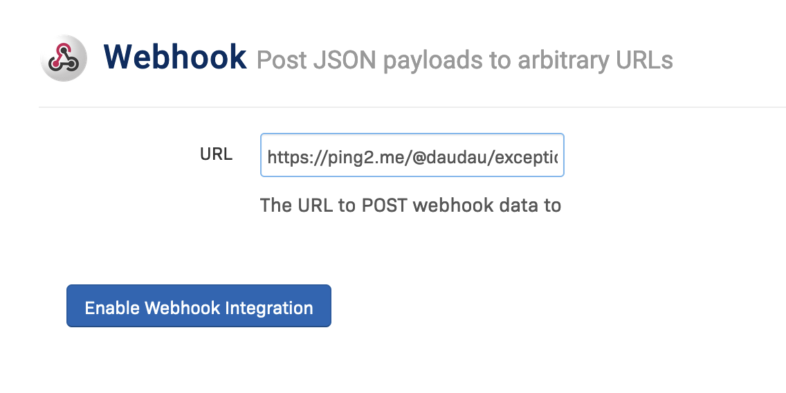

# Receiving Rollbar exception notifications to Telegram

Rollbar doesn't have Telegram notification integration, but it has a webhook integration. So we can use Ping2me to **receive notifications from Rollbar to Telegram**.

So first of all, you need to setup a channel and a Telegram bot on Ping2me.

Then visit Rollbar Project `Settings > Integrations > Notifications`, then active the webhook integration.
Put the channel endpoint to the `Webhook URL` field and save.

That's easy right? Now you can receive notifications from Rollbar to Telegram.

