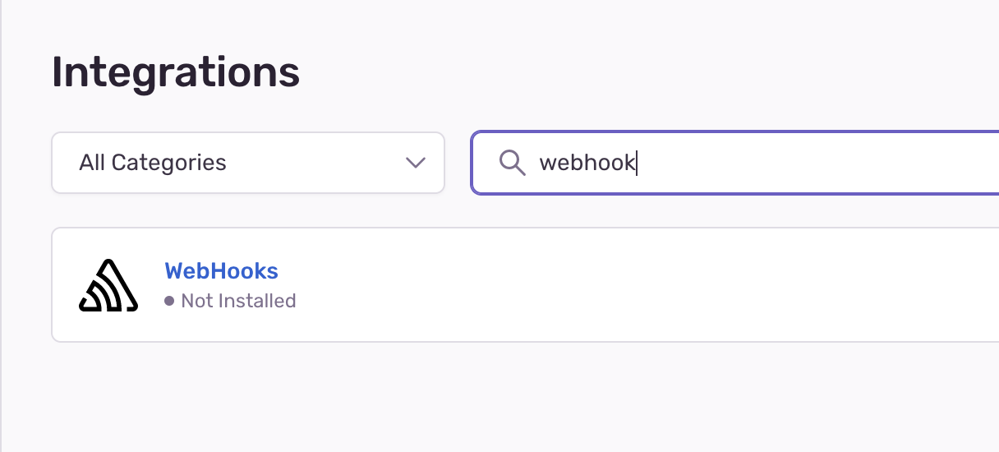
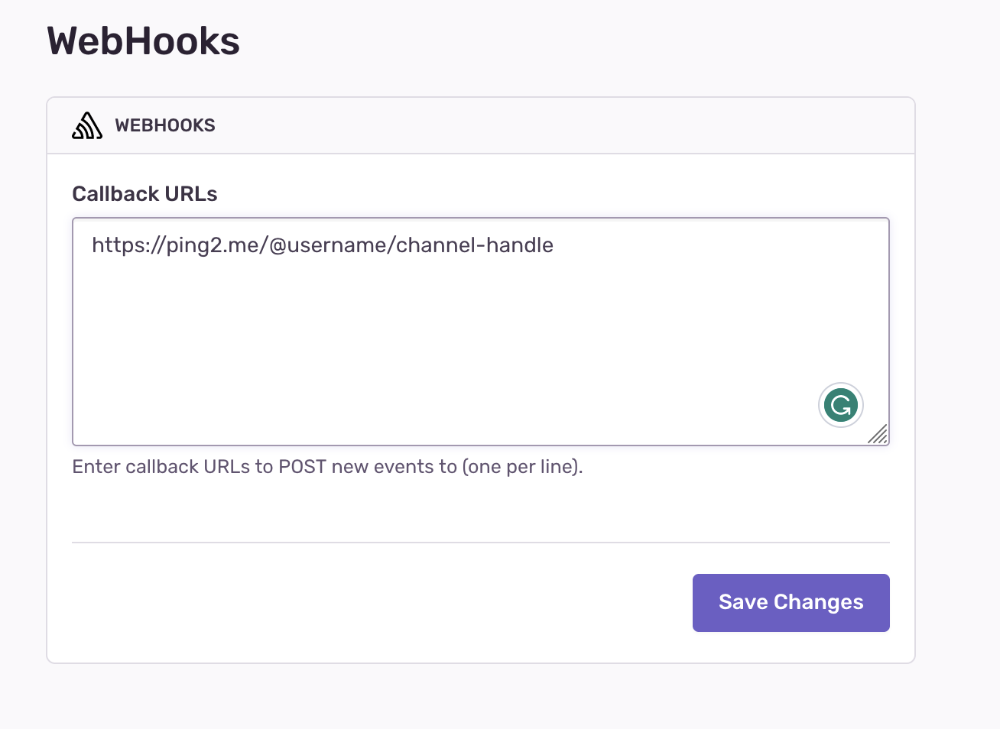

# Receiving Sentry exception notifications to Telegram

Because Sentry already has built-in integration with Discord, Slack,... but no Telegram. So we can use Ping2me to **receive notifications from Sentry to Telegram**.

So first of all, you need to setup a channel and a Telegram bot on Ping2me.

Then visit Sentry Project `Settings > Integrations`, then search for webhook

and add the channel endpoints to the `Callback URLs` field.

