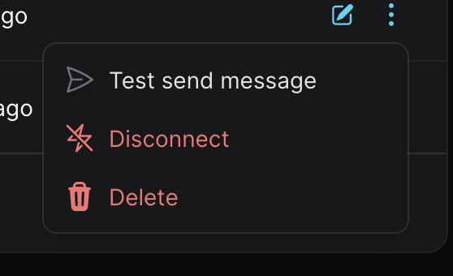
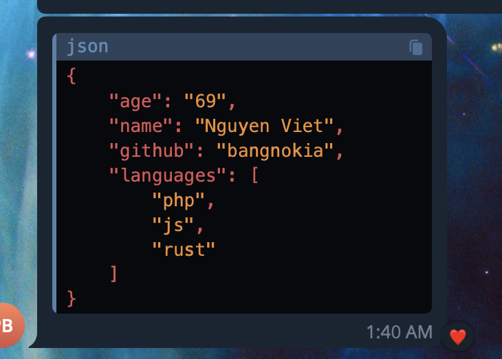

# Send your Message

To send a test message to your channel, to ensure everything is working as expected, you can click `Send test message` me nu button on the channel page.


## The ping api

If you want to send a message to your channel programmatically, you can use our ping api. The ping api is a simple http api, you can send a request to it and it will send a message to your channel.

The ping api url is simple as this:
```text
https://ping2.me/@{user-handle}/{channel-handle}
```
For example, your username handle is `daudau`, and your channel handle is `my-channel`, then your ping api url is `https://ping2.me/@daudau/my-channel`.

## Send a simple message

::: tip
If your payload is a json object, and the only key is `message`, we will use the value of that key as the message. Otherwise, we will use the whole payload as the message. If the payload can be json parsed, we will use the json string as the message.
:::

All the request body which is sent to the ping api will be foward to your channel as a message. For example, if you send a `GET` request with the following query string:
```text
https://ping2.me/@daudau/my-channel?message=Hello%20world
```

Then your channel will receive a message `Hello world`.

## Send complex payload
You know that, you can use the endpoint of channel as a webhook to intergrated with 3rd party services, then received the payload right in your chat app. Easy right, if you hate email notification like me, that why I create Ping2me 🤣.

So if the payload is a json object, ping2me automatically serialize it to a json string, then send it with beautiful format.
```bash
curl --location 'https://ping2.me/@daudau/my-channel' \
--header 'Content-Type: application/json' \
--data '{
    "name": "Nguyen Viet",
    "age": "69",
    "github": "bangnokia",
    "languages": ["php", "js", "rust"]
}'
```

You could receive a beautiful message like this:


Love it, right? 😍

## Integrate with your CI/CD
Example if you have a long running deploy script, or build script, you can send a message to your channel to notify when it's done.
```bash
curl https://ping2.me/@daudau/my-channel -d "message=Deploy script is done"
```

So simple, right?